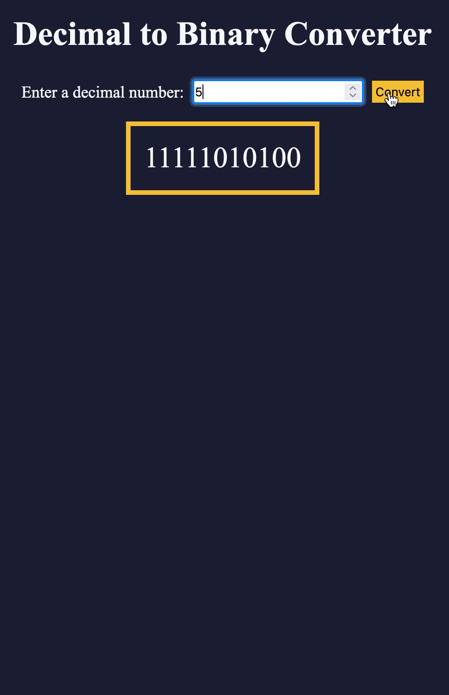

# Decimal to Binary Converter

Convert decimal numbers to binary using this simple Decimal to Binary Converter. The application demonstrates the binary conversion process with an animated call stack.

  

## Introduction

Decimal to Binary Converter is a web application built with HTML, CSS, and JavaScript. It provides an interactive way to convert decimal numbers to binary representation, offering both a straightforward conversion and a visual representation of the conversion process through an animated call stack.

## Features

- **Decimal to Binary Conversion:** Quickly convert decimal numbers to binary.
- **Conversion Animation:** Visualize the binary conversion process with an animated call stack.
- **User-friendly Interface:** Simple and intuitive interface for easy interaction.

## User Input

1. Enter a decimal number in the input field.
2. Click the "Convert" button or press "Enter" to initiate the conversion.
3. View the binary representation in the result area.
4. For a special demonstration, enter the number `5` to trigger the animated call stack.

## Conversion Animation

The application includes an animated call stack that visually represents the binary conversion process. It shows how the recursive function `decimalToBinary` operates, making it easier to understand the underlying algorithm.

## Getting Started

1. Clone the repository: `git clone https://github.com/Erikote04/Decimal-to-Binary-Converter.git`
2. Open the `index.html` file in a web browser.
3. Enter a decimal number in the input field and click the "Convert" button.

